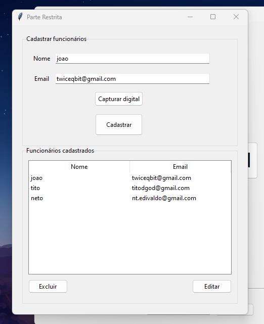

# Sistema de Registro de Ponto de Funcionários

## Visão Geral

Este é um sistema de registro de ponto de funcionários, desenvolvido para facilitar o acompanhamento preciso do horário de entrada e saída dos colaboradores.

## Funcionalidades Principais

- Registro de ponto de entrada e saída.
- Relatórios de presença diários

## Como usar :

 ### 1- Entre na área admin e cadastre  funcionarios
 
 
 ### 1.1- Cadastre a digital
 
 
 
 

 ## 2- Agora você pode voltar e verificar sua digital.
 

## To Do:
- [X] cadastrar salvando em um arquivo
- [X] limpar os campos das entry após o cadastro
- [X] por os dados do arquivo na treeview
- [X] fazer a verificação
- [X] fazer um arquivo mostrando quem foi verificado e o horario
- [X] poder editar esses dados
- [X] cadastrar salvando em um arquivo
- [X] enviar os dados no telegram por dia escolhido
- [X] aumentar a tela do admin e trocar o telefone por email
- [X] verificação na hora de cadastrar para n ir vazio
- [X] enviar email de confirmação do ponto pro funcionario
- [X] poder excluir um funcionario
- [ ] salvar o arquivo de dados no pc e na nuvem
- [ ] poder abrir um arquivo 

